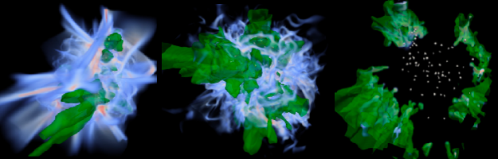

主に星形成に関する宇宙物理学についての理論研究をしています。
最近は、ALMAやJWSTの観測により、銀河系近傍から高赤方偏移銀河まで様々な環境での星形成領域についての研究が急速に進んでいます。
私たちのグループでは、星からの紫外線光の輻射輸送などを含めたシミュレーションを行うことで、星形成のメカニズムを解明することを目指しています。
 

名前: 福島　肇 (Hajime Fukushima) 

所属: 筑波大学 計算科学研究センター [宇宙物理理論研究室](https://www.rccp.tsukuba.ac.jp/Astro/home/ja/) 

身分: 助教 (テニュアトラック) 

住所: 〒305-8577 茨城県つくば市天王台1-1-1 

メール: fukushima_at_ccs.tsukuba.ac.jp 

研究分野: 主に天体形成 

業績等: [researchmap](https://researchmap.jp/fukushimahj/), [ADS](https://ui.adsabs.harvard.edu/search/fq=%7B!type%3Daqp%20v%3D%24fq_database%7D&fq_database=database%3A%20astronomy&p_=0&q=pubdate%3A%5B2018-01%20TO%209999-12%5D%20author%3A(%22%5EFukushima%2C%20hajime%22)&sort=date%20desc%2C%20bibcode%20desc?bbbRedirect=1), [TRIOS](https://trios.tsukuba.ac.jp/researcher/0000004676)   

# ニュース
- 23.10.26  [CCS広報インタビュー記事](https://www.ccs.tsukuba.ac.jp/research-topic-v13/)を作成していただきました。
- 23.05.12　新しいホームページへ移行を開始しました。
 

<a href="https://sites.google.com/view/fukushimahj-en">English</a>

